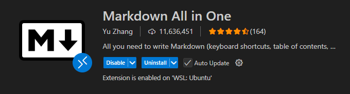

# Lab 02 — Lab Work Report

**Course:** Programming, lab02

**Institution:** NTU KhPI, Kharkiv, Ukraine

**Student:** *Smeliantsev Artem*

**Date:** *21.09.2025*

---

## Task Description

1. Install a Markdown extension in VS Code
2. Learn basic Markdown syntax
3. Create a short example document and format it
4. Write and submit this report

## Structure

`lab02`  
├── [`Report.md`](Report.md) # this file   
├── [`image.png`](iamge.png) # the screenshot proving i have markdown installed  
└── [`document.md`](document.md) # Lab-specific build configuration

## Lab Instructions

Use the following sources to learn get additioan info:
1. https://www.markdownguide.org/basic-syntax/ 
2. https://marketplace.visualstudio.com/items?itemName=bat67.markdown-extension-pack
3. https://pandoc.org/

## Report

* The goal of this lab is to learn the basics of Markdown and practice writing a properly formatted document.
  
* In this lab, I completed the following tasks:

* Installed a Markdown extension in VS Code

* Practiced headings, lists, code fences, tables, links, and images

* Created a short example file (example_doc.md)

* Prepared this report in Markdown format

## Proof (Screenshots / Photos)

## Observations & Conclusion`

* Markdown is quick to learn and useful for lab reports and READMEs.
* The VS Code Markdown preview helps catch formatting issues early.

---

