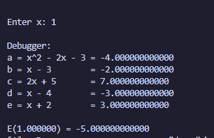
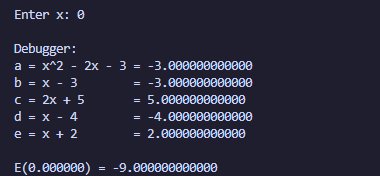
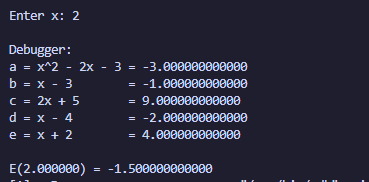
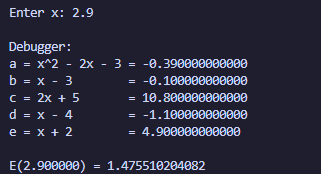
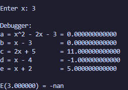
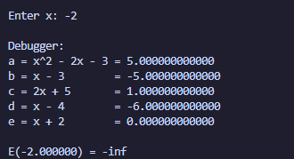

# Lab 03_01 — Lab Work Report (Variant 12)

---

**Course:** Programming, Part 1  
**Institution:** NTU KhPI, Kharkiv, Ukraine  
**Student:** Artem Smeliantsev  
**Date:** 2025-10-19

---

## Task (short)

Implement a C program that evaluates the arithmetic expression for a single input `x`, prints intermediate variables for debugging, and detects invalid inputs (zero denominators). Provide a debug session (or screenshot) showing intermediate values.

---

## Variant number and formula

**Variant:** 12

**Formula**  
**12.**  
$
E(x) = \frac{x^{2} - 2x - 3}{x - 3} \;+\; \frac{(2x + 5)(x - 4)}{x + 2}
$

---

## Files

- `task3_1.c` — source file implementing Variant 12  
- and a lot of screenshots (attach as `image-1.png`, `image-2.png`, ...)

---

## How to build / run

```bash
# compile
gcc -g -O0 -Wall task3_1.c -o task3_1 -lm

# run
./task3_1
# program will prompt: Enter x:
```

example: \


---

## Sample runtime output (3+ values)

### Example 1 — `x = 0`


Enter x: 0 \
E(0.000000) = 6.500000

 


### Example 2 — `x = 2`


Enter x: 2 \
E(2.000000) = 13.750000




### Example 3 — `x = 2.9` (near singularity)


Enter x: 2.9 \
E(2.900000) = 1.475510204082


### Undefined cases

```
Enter x: 3
E(5.000000) = -nan
```


```
Enter x: -2
E(-2.000000) = -inf
```



---
# Debug session

## GDB
``` bash
$ gdb ./task3_1
(gdb) break main
(gdb) run
Enter x: 0
(gdb) next
(gdb) print a
$1 = -3.000000000000000
(gdb) print b
$2 = -3.000000000000000
(gdb) print c
$3 = 5.000000000000000
(gdb) print d
$4 = -4.000000000000000
(gdb) print e
$5 = 2.000000000000000
(gdb) next
(gdb) print E
$6 = -9.000000000000000

(gdb) run
Enter x: 2
(gdb) next
(gdb) print a
$7 = -1.000000000000000
(gdb) print b
$8 = -1.000000000000000
(gdb) print c
$9 = 9.000000000000000
(gdb) print d
$10 = -2.000000000000000
(gdb) print e
$11 = 4.000000000000000
(gdb) print E
$12 = -1.500000000000000

(gdb) run
Enter x: 2.9
(gdb) next
(gdb) print b
$13 = -0.100000000000000
(gdb) print e
$14 = 4.900000000000000
(gdb) print E
$15 = 1.475510204081626

(gdb) run
Enter x: 3
(gdb) next
(gdb) print b
$16 = 0.000000000000000   
(gdb) print a
$17 = 3.000000000000000

```
---

### Observations and Conclusion

  - While running the program I observed the following behavior and results.

  - When I entered 0, the program printed E(0.000000) = -9.000000.
  (Calculation: (−3)/(−3) + (5·(−4))/2 = 1 + (−20)/2 = 1 − 10 = −9.)

  - When I entered 2, the program printed E(2.000000) = -1.500000.
  ((4 − 4 − 3)/(−1) + ((4 + 5)·(−2))/4 = (−3)/(−1) + (9·(−2))/4 = 3 + (−18)/4 = 3 − 4.5 = −1.5.)

  - When I entered 2.9 (close to 3), the program printed E(2.900000) ≈ 1.475510.
  The result changes noticeably near the singularity at x = 3.

  - When I entered 3, the program detected x - 3 == 0 and reported the expression as undefined (printed intermediate variables).

  - When I entered -2, the program detected x + 2 == 0 and reported the expression as undefined.
### Domain of definition (DOD)

Given  
$
E(x)=\frac{x^{2}-2x-3}{x-3} \;+\; \frac{(2x+5)(x-4)}{x+2},
$
factor the first numerator:
$
x^{2}-2x-3=(x-3)(x+1),
$
so for $x\neq 3$
$
\frac{x^{2}-2x-3}{x-3}=x+1.
$

**Denominator restrictions**
- $x-3 \neq 0 \Rightarrow x \neq 3.$  
  (The original expression is undefined at $x=3$ even though the fraction simplifies for other $x$.)
- $x+2 \neq 0 \Rightarrow x \neq -2.$

Therefore the domain (real values where the original expression is defined) is
$
\boxed{D=\mathbb{R}\setminus\{3,\,-2\}.}
$

**Remarks**
- \(x=3\) is a removable discontinuity: the simplified expression gives a finite limit at \(x\to3\), but the original formula is undefined there.
- \(x=-2\) is a vertical singularity for the second term (denominator zero while numerator is nonzero), so the expression diverges at \(x=-2\).