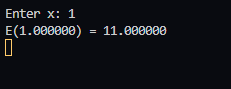
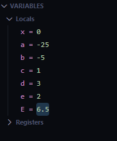
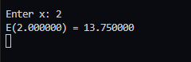
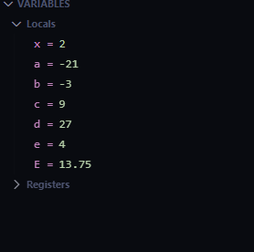
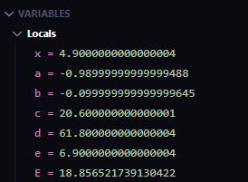
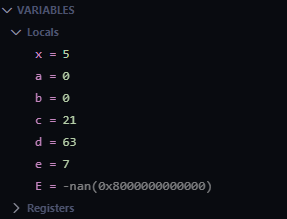
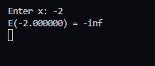
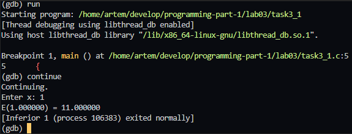

# Lab 03_01 — Lab Work Report (Variant 9)

---

**Course:** Programming, Part 1  
**Institution:** NTU KhPI, Kharkiv, Ukraine  
**Student:** Artem Smeliantsev  
**Date:** 19.10.20025

---

## Task (short)

Implement a C program that evaluates the arithmetic expression for a single input `x`, prints intermediate variables for debugging, and detects invalid inputs (zero denominators). Provide a debug session (or screenshot) showing intermediate values.

---

## Variant number and formula

**Variant:** 9

**Formula**  
**9.** 
$
E(x) = \frac{x^2 - 25}{x - 5} + \frac{3(4x + 1)}{x + 2}
$


---

## Files

- [`task3_1.c`](task3_1.c) # source file implementing Variant 9
- and a lot of screenshots

---

## How to build / run

```bash
# compile
gcc -g -O0 -Wall task3_1.c -o task3_1 -lm

# run
./task3_1
# program will prompt: Enter x:
```

example: \


---

## Sample runtime output (3+ values)

### Example 1 — `x = 0`

```
Enter x: 0
E(0.000000) = 6.500000
```

 => output \
 => debug  

### Example 2 — `x = 2`

```
Enter x: 2
E(2.000000) = 13.750000
```

 => output \
 => debug

### Example 3 — `x = 4.9` (near singularity)

```
Enter x: 4.9
E(4.900000) = 18.856522
```

 => output \
 => debug

### Undefined cases

```
Enter x: 5
E(5.000000) = -nan
```

 => output \
 => debug

```
Enter x: -2
E(-2.000000) = -inf
```

 => output \
 => debug

---
# Debug session
## Debugger screenshot



## GDB
```
$ gdb ./task3_1
(gdb) break main
(gdb) run
x = 0
(gdb) next
(gdb) print a
$1 = -25.000000
(gdb) next
(gdb) print b
$2 = -5.000000
(gdb) next
(gdb) print E
$3 = 6.500000000000000
(gdb) run
x = 2
(gdb) next
(gdb) print a
$4 = -21.000000
(gdb) next
(gdb) print E
$5 = 13.75000000000000
(gdb) run
x = 5
(gdb) next
(gdb) print b
$6 = 0.000000         # denominator b = x-5 == 0
(gdb) next
(gdb) print E
$7 = nan             # or +inf/-inf depending on platform
```
---

### Observations and Conclusion

> While running the program I observed the following behavior and results.

- When I entered `0`, the program printed `E(0.000000) = 6.500000`.  
    (Calculation seen: `(-25)/(-5) = 5` and `3*(1)/2 = 1.5`, total `6.5`.)

- When I entered `2`, the program printed `E(2.000000) = 13.750000`.  
    (`(-21)/(-3) = 7` and `27/4 = 6.75`, total `13.75`.)

- When I entered `4.9` (close to 5), the program printed `E(4.900000) ≈ 18.856522`.  
    I noticed the result changes quickly for small changes in `x` near `5` — the expression is highly sensitive there.

- When I entered `5`, the program attempted to divide by zero in the first term (`x-5 = 0`); the result became infinite/undefined (`inf` or `nan` depending on the runtime), i.e. the program produced an undefined numeric result.

- When I entered `-2`, the program attempted to divide by zero in the second term (`x+2 = 0`); similarly, the result became infinite/undefined.

- I observed that the program prints only the final value `E(x)` and does not display intermediate variables (`a`, `b`, `c`, `d`, `e`) during normal runs.

### DOD:

- **Domain:** \
$D = \mathbb{R} \setminus \{5, -2\}$

- **Simplification (for $x \neq 5$):** \
    $\frac{x^2 - 25}{x - 5} = x + 5$ 

**so, for $x \neq 5, -2$:**

$E(x) = x + 5 + \frac{3(4x + 1)}{x + 2}$

**Remarks:**

- x = 5 — removable discontinuity:  
  $\displaystyle \lim_{x \to 5} E(x) = 10 + 9 = 19$,  
  but the original expression is undefined at x = 5.
- x = -2  — vertical (essential) singularity:  
  the denominator of the second term equals 0 while the numerator equals -21,  
  so the value diverges (no finite limit).

**Conclusion:** Running the program shows correct numeric outputs for ordinary inputs, rapid growth and sensitivity of the result near `x = 5`, and undefined/infinite outcomes when `x = 5` or `x = -2`. The program does not report intermediate values or input-read errors during these runs.
