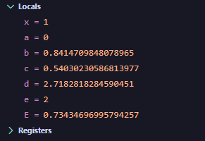
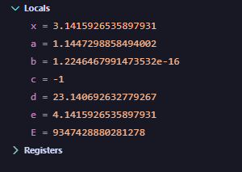
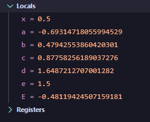
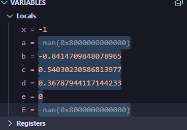

# Lab 03_02 — Lab Work Report (Variant 9)

---

**Course:** Programming, Part 1  
**Institution:** NTU KhPI, Kharkiv, Ukraine  
**Student:** Artem Smeliantsev  
**Date:** 20.10.2025

---

## Task (short)

Write a C program that evaluates the expression in Variant 9 for a single input x. The program must compute and print intermediate variables (so they can be inspected in a debugger).

---

## Variant number and formula

**Variant:** 9

**Formula**\
**9.**  \
$
E(x) = \frac{\ln x}{\sin x} \;+\; \frac{\cos x \cdot e^{x}}{x + 1}
$

---

## Files

- `task3_2.c` — source file implementing Variant 9 (no `if`-guards; prints intermediate variables)  
- (attach your debug screenshots as `image-1.png`, `image-2.png`, ... in the report)

---

## How to build / run

```bash
# compile
gcc -g -O0 task3_2.c -o task3_2 -lm

# run
gdb ./task3_2
# program will prompt: Enter x:
```

---

## Sample runtime output (3+ values)

### Example 1 — ```x = 1.0``` (regular finite case)

``` \
Enter x: 1

E(1.000000) = 0.734347
```

 => debugger

### Example 2 — ```x = 3.141592653589793``` (π)

``` \
Enter x: 3.141592653589793

E(3.141593) = 9347428880281278.000000
```

 => debugger

### Example 3 — ```x = 0.5```

``` \
Enter x: 0.5

E(0.500000) = -0.481194
```

 => debugger

### Undefined / special cases (observe ```inf``` / ```-inf``` / ```nan``` behaviour):

``` \
Enter x: -1

E(-1.000000) = -nan
```
 => debugger

## GDB debug session

```$ gdb ./task3_2
(gdb) break main
(gdb) run
Enter x: 1
(gdb) next
(gdb) print a
$1 = 0.000000000000   
(gdb) next
(gdb) print b
$2 = 0.841470984808   
(gdb) next
(gdb) print E
$3 = 0.734346969958   
(gdb) run
Enter x: 3.141592653589793
(gdb) next
(gdb) print b
$4 = 0.000000000000
(gdb) next
(gdb) print E
$5 = 9.347428880281278e+15
(gdb) run
Enter x: 0
(gdb) next
(gdb) print a
$6 = -inf
(gdb) print E
$7 = nan
```

### Observations and Conclusion

While running the program (without domain checks) I observed:

- For normal inputs (e.g., `x = 1`, `x = 0.5`), the program gives finite intermediate values and a valid `E(x)`.  
- When `sin(x)` ≈ 0 (e.g., `x ≈ kπ`), the result grows rapidly or becomes `inf`.  
- For `x = 0`, `ln(0)` → `-inf` and `sin(0)=0`, giving `nan` or `inf`.  
- For `x < 0` or `x = -1`, the result becomes `nan` due to invalid `ln(x)` or zero denominator.  
- The no-`if` version clearly shows how `nan` and `inf` appear in floating-point arithmetic, making it useful for debugging and understanding IEEE behavior.

---

### Domain of definition (DOD)

- `ln(x)` requires $x>0$.
- $\sin x$ must not be zero $\Rightarrow x \neq k\pi,\ k\in\mathbb{Z}$.  
- $x+1$ must not be zero $\Rightarrow x \neq -1$.

Combining the above (and noting $x>0$ excludes $x=-1$ and $x=0$ ):

$D \;=\; (0,\infty)\setminus\{k\pi \mid k\in\mathbb{N}\}
$
