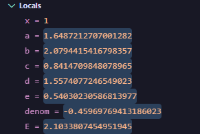
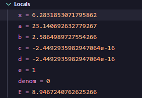
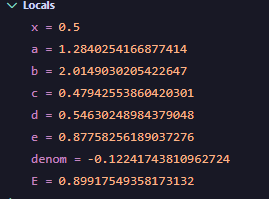

# Lab 03_02 — Lab Work Report (Variant 9)

---

**Course:** Programming, Part 1  
**Institution:** NTU KhPI, Kharkiv, Ukraine  
**Student:** Artem Smeliantsev  
**Date:** 20.10.2025

---

## Task (short)

Write a C program that evaluates the expression for Variant 12 for a single input `x`. The program must compute and make intermediate variables available so they can be inspected in a debugger (no if-guards for domain checking).

---

## Variant number and formula

**Variant:** 12

**Formula**\
**12.**  \
$
E(x)=\frac{e^{0.5x}}{\ln(x+7)} \;+\; \frac{\sin x \cdot \tan x}{\cos x - 1}
$

---

## Files

- `task3_2.c` — source file implementing Variant 9 (no `if`-guards; prints intermediate variables)  
- some 

---

## How to build / run

```bash
# compile with debug symbols
gcc -g -O0 task3_2_variant12.c -o task3_2_variant12 -lm

# run under gdb
gdb ./task3_2_variant12
# then in gdb: run
# program will prompt: Enter x:
```

---

## Sample runtime output (3+ values)

### Example 1 — ```x = 1.0``` (regular finite case)

``` \
Enter x: 1

E(1.000000) = -2.057948
```



### Example 2 — ```cos(x) = 1 (x ≈ 2π)```

``` \
Enter x: 6.283185307179586

E(6.283185) = 8.946724
```



### Example 3 — ```x = 0.5```

``` \
Enter x: 0.5

E(0.500000) = 0.899175
```



### Undefined / special cases (observe inf / -inf / nan behaviour)

Enter x: -6 → ln(x+7) = ln(1) = 0 → first term divides by zero → ±inf or nan.

Enter x: 2π → cos x = 1 → denom of second term = 0 → ±inf.

Enter x: π/2 → cos x ≈ 0 → tan x becomes large (or ±inf) → the second term may be very large/±inf.

Enter x: -7 → ln(0) = -inf → arithmetic can produce nan when summed.

## GDB debug session

```bash
$ gdb ./task3_2_variant12
(gdb) break main
(gdb) run
Enter x: 1
(gdb) next
(gdb) print a
$1 = 1.64872127070013
(gdb) next
(gdb) print b
$2 = 2.07944154167984
(gdb) next
(gdb) print E
$3 = -2.05794838399852

# run another session
(gdb) run
Enter x: 6.283185307179586
(gdb) next
(gdb) print e
$4 = 1.00000000000000
(gdb) next
(gdb) print denom
$5 = 0.00000000000000
(gdb) next
(gdb) print E
$6 = inf
```

# Domain of definition (D)

The expression
$
E(x)=\frac{e^{0.5x}}{\ln(x+7)} \;+\; \frac{\sin x \cdot \tan x}{\cos x - 1}
$
is defined under the following conditions:
- $ \ln(x+7) $ is defined and nonzero $\Rightarrow x + 7 > 0$ and $ \ln(x+7) \ne 0$.  
  → $x > -7$ and $x \ne -6$ (because $\ln(1)=0$ gives division by zero).
- $ \tan x $ is defined $\Rightarrow \cos x \ne 0$.
- the denominator of the second fraction is nonzero $\Rightarrow \cos x - 1 \ne 0 \Rightarrow \cos x \ne 1$.

Combining these:
$
D \;=\; (-7,\infty)\ \setminus\ \big(\{ -6 \}\ \cup\ \{x:\cos x = 0\}\ \cup\ \{x:\cos x = 1\}\big).
$
Equivalently:
$
D = \{x\in\mathbb{R}\mid x>-7,\ \cos x\neq 0,\ \cos x\neq 1,\ x\neq -6\}.
$

**Common special points to exclude:**
- $x = -6$ (because $\ln(x+7)=\ln 1 = 0$).
- $x = 2k\pi,\ k\in\mathbb{Z}$ (because $\cos x = 1$ → second denominator = 0).
- $x = \tfrac{\pi}{2} + k\pi,\ k\in\mathbb{Z}$ (because $\cos x = 0$ → $\tan x$ undefined).

**Numeric / practical note:** in floating-point computations, values *near* the excluded points (e.g., $x$ very close to $-6$, $2k\pi$, or $\tfrac{\pi}{2}+k\pi$) may produce very large magnitudes, `inf`, or `nan` due to round-off—treat denominators with a small tolerance when writing checks.

---

# Conclusions

**English (observations, behaviour, recommendations):**
- Behaviour: For inputs inside $D$ far from singularities the expression evaluates to a finite value. When an excluded condition is met (exactly or numerically), the result may be `±inf` or `nan` because of division by zero or operations on infinities.
- Observed failure modes:
  - `ln(x+7)=0` (x = −6) → division by zero in the first term.
  - `cos x = 1` (x = 2kπ) → division by zero in the second term.
  - `cos x = 0` (x = π/2 + kπ) → `tan x` undefined → second term blows up.
- Recommendations for robust implementation:
  1. **Guard inputs**: check `x > -7` and explicitly exclude `x == -6`, `cos(x)` near `0` or `1` (use a tolerance, e.g. `fabs(cos(x)) < eps` or `fabs(cos(x)-1) < eps` with `eps = 1e-12`..`1e-8` depending on scale).
  2. **Detect and handle `inf`/`nan`**: after computing intermediate values, test with `isfinite()`, `isnan()`, `isinf()` and print a friendly error message when results are invalid.
  3. **Avoid catastrophic cancellation**: consider using `long double` if higher precision is needed, or restructure expressions if algebraic cancellation is suspected.
  4. **Provide diagnostic output**: when teaching/debugging, keep the no-guard variant to show how IEEE-754 behaves; for submission, prefer the guarded variant.
- Example guard snippet (C-style, conceptual):
```c
double eps = 1e-12;
if (!(x > -7.0)) { /* reject */ }
if (fabs(log(x+7.0)) < eps) { /* reject or handle */ }
double cx = cos(x);
if (fabs(cx) < eps) { /* tan undefined */ }
if (fabs(cx - 1.0) < eps) { /* denom = 0 */ }
